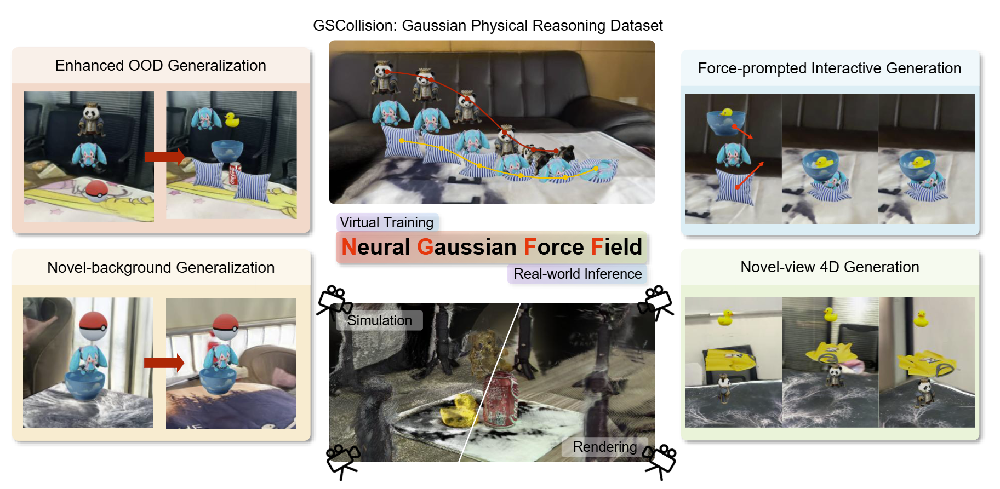

<h1 align="center"> Learning Physics-Grounded 4D Dynamics with Neural Gaussian Force Fields</h1>

<h3 align="center">ICLR 2026</h3>

<div align="center">
    <p>
        <a href="https://lishiqianhugh.github.io/">Shiqian Li</a><sup>1*</sup>&nbsp;&nbsp;
        <a href="https://ruihong04.github.io/">Ruihong Shen</a><sup>1*</sup>&nbsp;&nbsp;
        <a href="https://dali-jack.github.io/Junfeng-Ni/">Junfeng Ni</a><sup>2</sup>&nbsp;&nbsp;
        <a href="https://pku.ai/author/chang-pan/">Chang Pan</a><sup>1</sup>&nbsp;&nbsp;
        <a href="http://wellyzhang.github.io/">Chi Zhang</a><sup>1†</sup>&nbsp;&nbsp;
        <a href="https://yzhu.io/">Yixin Zhu</a><sup>1†</sup>&nbsp;&nbsp;
    </p>
    <p>
        <sup>1</sup>Peking University &nbsp;&nbsp;&nbsp;
        <sup>2</sup>Tsinghua University &nbsp;&nbsp;&nbsp;
    </p>
    <p>
        <sup>*</sup> Equal Contribution &nbsp;&nbsp;&nbsp;
        <sup>†</sup> Corresponding Author
    </p>
</div>

<p align="center">
    <a href='https://neuralgaussianforcefield.github.io/' target="_blank">
        
    </a>
    <a href='https://arxiv.org/pdf/2602.00148' target="_blank">
        
    </a>
    <a href='https://huggingface.co/datasets/lishiqianhugh/GSCollision' target="_blank">
        
    </a>
    <a href='https://vimeo.com/1126658030' target="_blank">
        
    </a>
</p>



## 🔧 Setting up
### Clone the repo
```
git clone https://github.com/lishiqianhugh/NeuralGaussianForceField
```
### Python environment

Run:
```bash
conda create -n ngff python=3.10 -y
conda activate ngff
bash setup_env.sh
```

to setup the conda environment easily.

### Download pretrained models
1. SuperGlue
```bash
wget -O videogen/externals/superglue/weights/superglue_indoor.pth https://github.com/magicleap/SuperGluePretrainedNetwork/raw/master/models/weights/superglue_indoor.pth
wget -O videogen/externals/superglue/weights/superglue_outdoor.pth https://github.com/magicleap/SuperGluePretrainedNetwork/raw/master/models/weights/superglue_outdoor.pth
wget -O videogen/externals/superglue/weights/superpoint_v1.pth https://github.com/magicleap/SuperGluePretrainedNetwobrk/raw/master/models/weights/superpoint_v1.pth
```

2. OSEDiff

Download [stable-diffusion-2.1-base](https://huggingface.co/stabilityai/stable-diffusion-2-1-base) from huggingface and put it in `videogen/checkpoints/OSEDiff/stable-diffusion-2-1-base`
```bash
wget -O videogen/checkpoints/OSEDiff/ram_swin_large_14m.pth https://huggingface.co/spaces/xinyu1205/recognize-anything/blob/main/ram_swin_large_14m.pth
wget -O videogen/checkpoints/OSEDiff/DAPE.pth https://github.com/cswry/OSEDiff/blob/main/preset/models/DAPE.pth
wget -O videogen/checkpoints/OSEDiff/osediff.pkl https://github.com/cswry/OSEDiff/blob/main/preset/models/osediff.pkl
```

3. Pi3_splat
```bash
huggingface-cli download lishiqianhugh/Pi3_splat \
  --repo-type model \
  --revision main \
  --local-dir ./videogen/checkpoints/Pi3_splat \
  --local-dir-use-symlinks False
```

4. DiffSplat

Download [DiffSplat](https://huggingface.co/chenguolin/DiffSplat) from huggingface and put it in `videogen/checkpoints/DiffSplat`
Note that for `sd1.5`, you only need to download `gsdiff_gobj83k_sd15_image__render`, `elevest_gobj265k_b_C25`, `gsrecon_gobj265k_cnp_even4`, `gsvae_gobj265k_sd`.
If you want to refine object reconstruction using `sd3.5`, you also need to download `gsdiff_gobj83k_sd35m_image__render` and `gsvae_gobj265k_sd3`.


5. SAM2
```bash
wget -O videogen/checkpoints/sam2/sam2.1_hiera_l.yaml https://github.com/facebookresearch/sam2/blob/main/sam2/configs/sam2.1/sam2.1_hiera_l.yaml
wget -O videogen/checkpoints/sam2/sam2.1_hiera_large.pt https://dl.fbaipublicfiles.com/segment_anything_2/092824/sam2.1_hiera_large.pt
```

## 📊 Data generation
The data should be organized as :

```
GSCollision/        # Root folder of the dataset
│── objects/        # Individual object Gaussian splats (PLY files)
│   ├── panda/       # Gaussian splats of "panda" object
│   ├── can/        # Gaussian splats of "can" object
│   ├── ball/     # Gaussian splats of "ball" object
│   └── ...
│
│── backgrounds/    # Background Gaussian splats (PLY files)
│   ├── table0/     
│   ├── table1/      
│   └── ...
│
│── scene_configs/  # Scene composition configuration files
│   ├── 3_0.json
│   ├── 4.json
│   ├── 6.json
│   └── ...
│
│── scenes/  # Combined multi-object Gaussian splats (static gaussians)
│   ├── 3_0/         
│   │   ├── 0_panda_ball_can  # containing PLY files
│   │   └── ...
│   ├── 4/
│   ├── 6/
│   └── ...
│
│── initial/  # Multi-view images of initial scenes with backgrounds
│   ├── 3_0/
│   │   ├── 0_panda_ball_can # containing MP4 files
│   │   └── ...
│   ├── 4/
│   ├── 6/
│   └── ...
│
│── mpm/   # Simulation results (dynamic gaussians without backgrounds)
│   ├── 3_0/
│   │   ├── 0_panda_ball_can  # containing H5 files
│   │   └── ...
│   ├── 4/
│   ├── 6/
│   └── ...
│
│── dynamic/   # Renderd videos
│   ├── 3_0/
│   │   ├── 0_panda_ball_can  # containing MP4 files with different backgrounds and views
│   │   └── ...
│   ├── 4/
│   ├── 6/
│   └── ...
│
└── README.md  # Documentation for dataset structure, usage, and metadata
```

Step 1: Config the json files in `scene_configs` to set initial object poses or generate config files automatically by running `python -m dataset.generate_configs --obj_num 2 --scene_num 5`

Step 2: Run `python -m dataset.generate_scene --input {json_file} --output {output_dir}` to generate Gaussians. Run `scripts/generate_scene.sh` to generate all on a slurm cluster.

Step 3: Run the following simulation file to simulate dynamics using MPM. Specify `--model_path` for foreground objects, and `--config` for simulation and camera settings. The simulated gaussians (.h5) will be saved into `--output_path`.

```bash
python -m dataset.gs_simulation_scene \
--model_path /mnt/nfs_project_a/shared/data/ply_output/scenesoccersoccer/soccer_soccer_0 \
--config ./config/dynamic_config.json \
--output_path ./output/soccer_soccer_0 \
--save_h5 
```
Run `bash scripts/mpm.sh` to generate all scenes on a slurm cluster.

Step 4: Render the images for `--model_path` by specifying `--background_path` for backgrounds, `--config` for camera settings, and `--single_view` for certain view (moving camera if not specified, render all 100 views if specified as `-1`). The multi-view images of initial scenes and the dynamic output will be saved into `--initial_path` and `--output_path`, respectively. `--render_depth` renders normalized depthmaps into uint16 PNGs.

```bash
python -m dataset.render \
--model_path ./data/GSCollision/mpm/3_0/0_panda_ball_can \
--background_path ./data/GSCollision/backgrounds/table6 \
--config ./config/dynamic_config.json \
--initial_path ./data/GSCollision/initial_123/3_0/0_panda_ball_can/table6 \
--output_path ./data/GSCollision/dynamic_123/3_0/0_panda_ball_can/table6 \
--render_img \
--render_depth \
--compile_video \
--white_bg \
--fixed_view -1
```

Run `bash scripts/render.sh` to render all scenes on a slurm cluster.

### 🚀 Training the dynamic models
Train dynamic models. Take ngff for example.

```bash
accelerate launch -m dynamic_models.train \
--num_keypoints 2048 \
--ode_method euler \
--step_size 2e-2 \
--lr 1e-3 \
--min_lr 1e-4 \
--hidden_dim 128 \
--num_layers 4 \
--batch_size 8 \
--steps 80 \
--chunk 80 \
--epochs 2000 \
--dynamic_model ngff \
--sample_num 10 \
--threshold 5e-2
```

Train with multiple GPUs:
```bash
accelerate launch --multi_gpu --num_processes=4 --main_process_port=29500 -m dynamic_models.train \
--num_keypoints 2048 \
--ode_method euler \
--step_size 2e-2 \
--lr 3e-4 \
--min_lr 5e-5 \
--hidden_dim 128 \
--num_layers 4 \
--batch_size 13 \
--steps 60 \
--chunk 60 \
--epochs 500
```


### 4D Video prediction
This part contains the code for generating 4D videos using the trained NGFF dynamics model.
1. Reconstruction
    ```bash
    python -m videogen.reconstruct \
    --data_path ./data/GSCollision/initial/3_9/2700_duck_bowl_ball/table3/2700_duck_bowl_ball.mp4 \
    --save_folder debug \
    --interval 4 --visualize \
    [--refine]
    ```
    For batched inference, you can specify `--batch_inference_json` to specify the json file containing the data path and save folder.
    You need to create a json file with the following format:
    ```json
    [
        {
            "data_path": ,
            "save_folder": 
        },
        {
            "data_path": ,
            "save_folder": 
        }
    ]
    ```
    The segemented object file and background gaussian .ply file will be saved.

2. Run inference to generate 4D videos
    ```bash
    python -m videogen.eval \
    --model_path ./data/GSCollision/reconstruct/3_9/2700_duck_bowl_ball/table3/sim_refine \
    --background_path ./data/GSCollision/reconstruct/3_9/2700_duck_bowl_ball/table3/bg \
    --dynamic_model ngff \
    --config ./config/dynamic_config.json \
    --output_path ./data/GSCollision/videogen_inference/NGFF_V/refine/3_9/2700_duck_bowl_ball/table3/view_0 \
    --compile_video \
    --white_b \
    --single_view 0 \
    --resolution 448
    ```
    or infer with ground-truth foreground objects by moidify `--model_path` (use simple ground as background if `--background_path` is not specified):
    ```bash
    python -m videogen.eval \
    --model_path ./data/GSCollision/scenes/3_9/2810_bowl_pillow_can \
    --dynamic_model ngff \
    --config ./config/dynamic_config.json \
    --output_path output/dynamic_prediction/ngff/2810_bowl_pillow_can \
    --compile_video \
    --white_b \
    --single_view 0
    ```
    Specify `--dynamic_model` to use other models.


3. We also provide a pipeline script for reconstructing and generating 4D videos online.
    ```bash
    python -m videogen.pipeline_reconstruct_and_eval --batch_inference_json ./data/GSCollision/jsons/batch_circle360_1.json --models NGFF,Pointformer,GCN --config ./config/dynamic_config.json --steps 100 --resolution 448 --output_root ./data/GSCollision/videogen_inference_highres_360_debug/
    ```
    For batched inference, you can specify `--batch_inference_json` to specify the json file containing the data path and save folder.

    ```json
    [
        {
            "data_path": "./data/GSCollision/initial/3_9/2951_phone_duck_miku/table2/",
            "views": "84"
        },
        {
            "data_path": "./data/GSCollision/initial/3_9/2951_phone_duck_miku/table6/",
            "views": "0,circle360"
        }
    ]
    ```


## 🌎 Visualize gaussians in web browser
Run the following command to build a visualization on server with a server_port:
```bash
python -m tools.gaussian_viser --ply_path debug/edited_gaussians.pt --port 8088
```

Open a local terminal and enter the command:
```bash
ssh -L [local_port]:[computenode]:[server_port] user@server
```
Then, open your web browser and type the address `localhost:{local_port}`


## 😊 Acknowledgment

This project extends our prior research on **[Neural Force Field](https://neuralforcefield.github.io/)**, which focuses on abstract physical reasoning.

Our codebase is built upon many fantastic projects. We thank the following project authors for generously open-sourcing their code:
- [PhysGaussian](https://github.com/XPandora/PhysGaussian)
- [SuperGlue](https://github.com/magicleap/SuperGluePretrainedNetwork)
- [OSEDiff](https://github.com/cswry/OSEDiff)
- [Pi3](https://github.com/yyfz/Pi3)
- [DiffSplat](https://github.com/chenguolin/DiffSplat)
- [SAM2](https://github.com/facebookresearch/sam2)

## 📚 Citation
If you find our work helpful, please consider citing:
```bibtex
@inproceedings{
  Li2026PhysicsGrounded4D,
  title     = {Learning Physics-Grounded 4D Dynamics with Neural Gaussian Force Fields},
  author    = {Li, Shiqian and Shen, Ruihong and Ni, Junfeng and Pan, Chang and Zhang, Chi and Zhu, Yixin},
  year      = {2026},
  booktitle = {ICLR},
  url       = {https://neuralgaussianforcefield.github.io/}
}
```